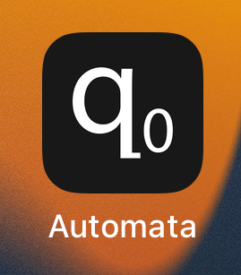
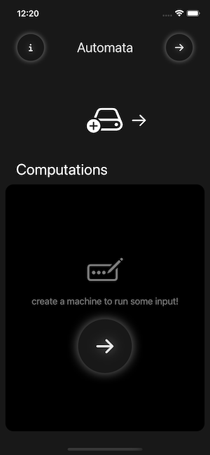
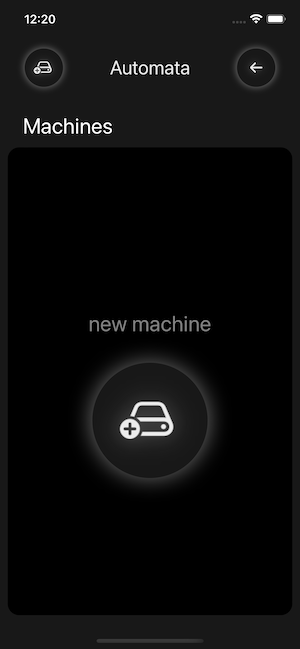
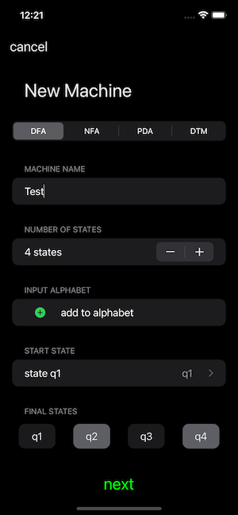
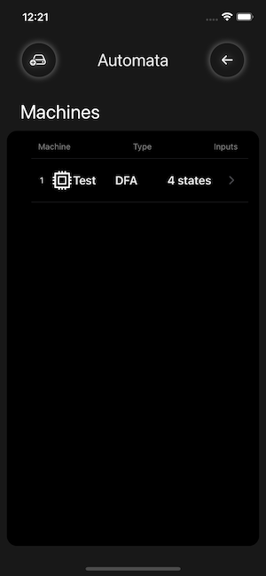
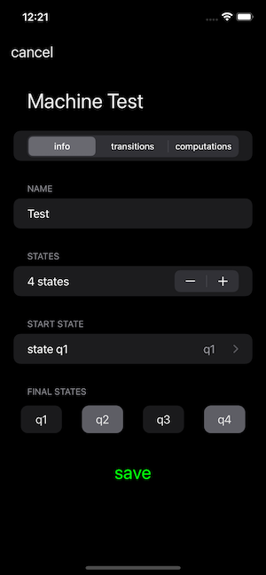

# Automata: an iOS app implementing the Automata Library. 

## icon
<table>
  <tr>
    <td></td>
   </tr> 
</table>

## simulation screenshots

<table>
   <tr>
      <td></td>
      <td></td>
  </tr>
  <tr>
      <td></td>
      <td></td>
  </tr>
  <tr>
      <td></td>
      <td></td>
  </tr>
</table>
